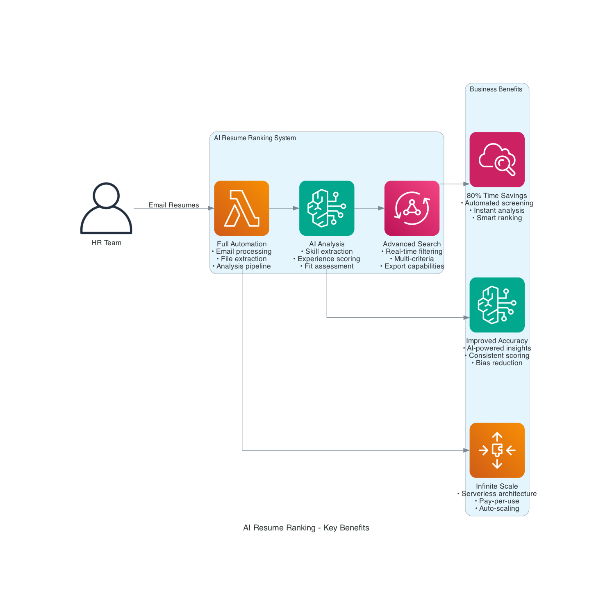
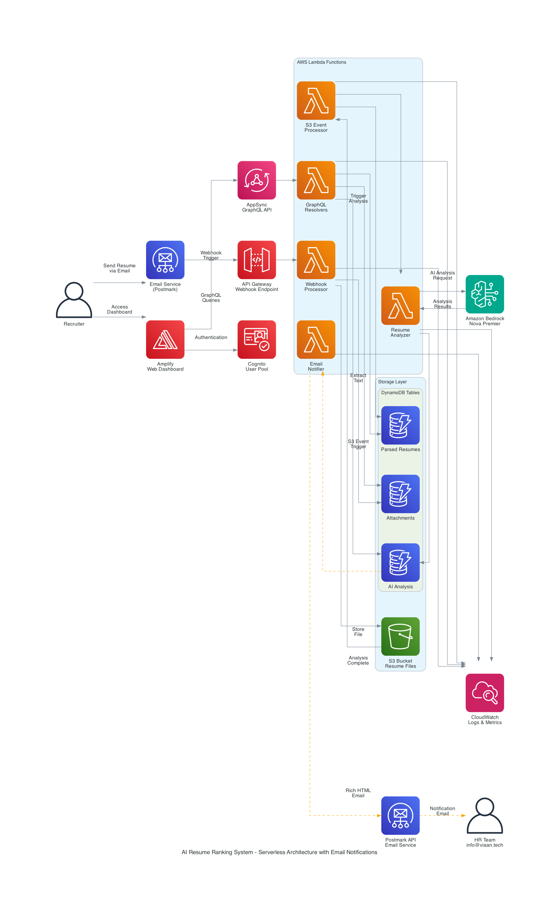

# GenAI Career Coach using AWS

AI-powered Resume Analysis and Career Guidance Platform built using AWS Cloud Services and Generative AI.

## Project Overview

GenAI Career Coach is a cloud-based application that analyzes resumes, evaluates candidate profiles, identifies skill gaps, and provides AI-powered career insights. The platform utilizes AWS serverless services and Generative AI to automate resume assessment and candidate analysis.

## Architecture

## Key Features

* Resume Upload and Storage
* AI-Powered Resume Analysis
* Candidate Ranking and Scoring
* Skill Gap Identification
* Resume Insights Dashboard
* Advanced Search and Filtering
* Real-Time Data Processing
* Serverless AWS Architecture

## AWS Services Used

* Amazon S3
* AWS Lambda
* Amazon DynamoDB
* Amazon Bedrock
* AWS AppSync
* AWS Cognito
* AWS Amplify

## Project Objective

To build a scalable cloud-native solution for automated resume screening and candidate evaluation using AWS serverless technologies and Generative AI.

## Contributor

Kshitij Varshikar

## Future Enhancements

* AI Interview Question Generator
* Personalized Learning Roadmaps
* Job Recommendation Engine
* Resume Improvement Suggestions
* ATS Compatibility Analysis
* AI Mock Interview Assistant
